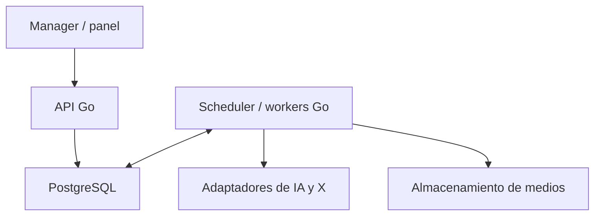

# BandIA — Plan de implementación y contrato de API

Versión 1 · 9 de septiembre de 2026 · Diseño propuesto para implementar

Referencia funcional: [spec](spec.md). Lenguaje principal: Go. Este documento define el trabajo pendiente; no describe endpoints de negocio ya disponibles. El código inicial sólo responde salud y preparación; las pruebas de esa base aún deben ejecutarse en un entorno con Go.

## 1. Qué debe lograr la aplicación

Una instrucción del manager o una agenda programada debe producir un ciclo observable: reunión real → decisiones y tareas → versiones musicales → audio evaluado → contenido publicado → feedback → cambios en el siguiente ciclo. Cada paso deja resultados durables y puede fallar sin fabricar avances ni perder lo ya completado.

El primer objetivo implementable es más pequeño: pedir una reunión, obtener un ID, cerrar el cliente y volver a leer las intervenciones reales de los agentes y sus decisiones. Reiniciar el servicio no debe borrar esa reunión. Sin claves o presupuesto, debe informar qué falta; no reemplazar agentes con textos fijos.

La API es el acceso del manager y del panel. Scheduler y workers invocan servicios de aplicación en Go, con las mismas validaciones y controles; no hacen HTTP contra sí mismos para simular cada paso. Las herramientas ofrecidas a los agentes son comandos tipados y acotados, no acceso libre a endpoints administrativos.

## 2. Arquitectura de implementación propuesta

Un repositorio y una aplicación modular. Se propone PostgreSQL para estado, cola inicial de trabajos y outbox transaccional; almacenamiento de objetos compatible con S3 para medios. Esto concreta una opción técnica de este plan, todavía no contratada ni configurada. No hace falta Redis ni un broker separado para la primera banda.



| Módulo Go | Responsabilidad |
| --- | --- |
| `httpapi` | Autenticación, contratos HTTP, validación de entrada y serialización. |
| `band` | Identidad versionada, elenco, instrucciones del manager y decisiones. |
| `meetings` | Contexto, rondas, mensajes originales, cierre y tareas resultantes. |
| `jobs` | Cola durable, leases, intentos, reanudación, cancelación y outbox. |
| `scheduling` | Horarios, fechas locales, disparos omitidos y prioridades. |
| `music` | Canciones, versiones, generaciones, evaluación y selección. |
| `media` | Artefactos, cargas, validación y montaje de audio/portada. |
| `social` | Cuentas, conexión OAuth, contenido, publicaciones y reconciliación. |
| `feedback` | Captura, síntesis, experimentos y aprendizajes. |
| `operations` | Políticas, reservas de presupuesto, uso, auditoría e informes. |
| `adapters` | Proveedores de texto, audio, imágenes, X, base y almacenamiento. |

Primero pueden ejecutarse API, scheduler y worker en un mismo proceso; conservar límites de módulos y permitir separarlos por modo de arranque sin cambiar los contratos. Python queda reservado para herramientas de medios que lo requieran; Go administra ejecución, costos, timeouts y resultados. El runner de medios sólo acepta operaciones permitidas, nunca comandos shell arbitrarios producidos por agentes.

## 3. Reglas comunes de la API

- Prefijo `/v1`; una banda configurada por despliegue. No crear un producto multiempresa en esta POC.
- IDs opacos e inmutables. Un cambio de nombre artístico no cambia el ID de banda, personaje o canción.
- JSON con `snake_case`; fechas UTC en formato RFC 3339 y zona IANA explícita en agendas. Listados usan `limit` y `cursor`, máximo propuesto 100; orden estable por tiempo e ID. Las rutas con `{id}` resuelven IDs locales, no nombres públicos.
- Autenticación obligatoria en `/v1`, salvo callback OAuth y webhooks, que verifican su propio protocolo. Para la POC se propone token del manager en el entorno; un futuro panel web usa sesión de servidor segura. No incluir secretos en URLs, respuestas, logs o Git. `/healthz` y `/readyz` sólo devuelven información operativa mínima.
- El actor y sus permisos provienen de la autenticación; nunca aceptar `actor_role` del cuerpo como autoridad. El actor interno representa al worker; cada acción originada en agentes enlaza el mensaje/decisión que la motivó.
- Mutaciones creativas del worker no requieren aprobación humana. Políticas, presupuesto, conexiones y pausa global son controles del manager. Tener un repositorio público no convierte en pública la API ni las conversaciones.
- Creación inmediata: `201 Created`. Trabajo asíncrono: `202 Accepted` con recurso, `job_id` y enlace de consulta; sólo después de guardar todo en una transacción. No mantener una conexión HTTP esperando una canción o una reunión.
- `Idempotency-Key` obligatoria en comandos de creación, ejecución, reintento y publicación. Alcance: banda + actor + operación + clave; guardar hash del cuerpo. Misma clave y cuerpo devuelve el mismo resultado; misma clave con otro cuerpo produce 409. La clave del trabajo lógico no se pierde al crear un intento nuevo.
- Recursos editables devuelven `ETag`; `PATCH` requiere `If-Match`, con 428 si falta y 412 si la versión cambió. Versiones creativas y mensajes son inmutables: una revisión crea otro recurso.
- Error común: `error.code`, `error.message`, `error.details` saneados y `request_id`. Usar 400 para JSON inválido, 401/403 para identidad/permisos, 404 para recurso inexistente, 409 para conflicto de estado, 422 para referencias o restricciones de negocio, 429 para límites locales y 503 cuando no se puede aceptar trabajo durable.
- Una solicitud válida puede crear un job `blocked` si falta una integración o presupuesto. Su 202 significa que quedó registrada, no que se ejecutó. El motivo y la condición de desbloqueo quedan visibles. Los endpoints de fases aún no implementadas no devuelven éxitos vacíos; `GET /v1/system` anuncia capacidades disponibles.
- Datos de pruebas identificados como `synthetic`, aislados de métricas reales y sin posibilidad de publicación productiva. Ningún modo de simulación es el fallback automático de una integración fallida.

## 4. Endpoints por dominio

Las tablas son el contrato objetivo, no una lista para construir toda junta. Fase indica el primer incremento que necesita la ruta. M = manager; S = servicio interno con permisos acotados. Los GET de negocio son de M; las consultas internas reutilizan los servicios Go. Cada fila con múltiples métodos se expandirá en OpenAPI durante su fase.

### 4.1. Estado, configuración e identidad

| Método y ruta | Entrada / resultado | Fase y permiso |
| --- | --- | --- |
| `GET /healthz` | 200 si responde el proceso. Ya existe. | P0, mínimo público |
| `GET /readyz` | 200 si puede aceptar trabajo durable; 503 si no. Hoy siempre 503. No confundir con proveedores operativos. | P0, mínimo público |
| `GET /v1/system` | Versión/commit, modo, worker heartbeat, migraciones y capacidades con estado y bloqueo. Sin secretos. | P0, M |
| `GET /v1/band` | Identidad y formación vigentes, referencias a versiones. | P1, M |
| `POST /v1/band/versions` | Nueva identidad artística con `base_version`, nombre, descripción, dirección y decisión de origen. Activa la versión atómicamente. | P1, M/S |
| `GET /v1/band/versions` | Historia de nombres, identidad y formación; no reescribe el pasado. | P1, M |
| `GET /v1/characters` | Elenco actual o histórico, filtrable por estado/rol. | P1, M |
| `POST /v1/characters` | Crear personaje y primera ficha, rol y condición de miembro; no crea una cuenta social. | P1, M/S |
| `GET /v1/characters/{id}` | Perfil vigente y referencias a versiones. | P1, M |
| `GET /v1/characters/{id}/versions` | Versiones de personalidad, biografía, criterio y apariencia. | P1, M |
| `POST /v1/characters/{id}/versions` | Revisar ficha, retirar/reactivar o cambiar rol, con motivo y versión base. | P1, M/S |
| `POST /v1/manager-instructions` | Brief o cambio de dirección, prioridad, vigencia y referencia opcional a instrucción reemplazada. | P1, M |
| `GET /v1/manager-instructions` | Instrucciones vigentes e históricas, con estado de incorporación a reuniones. | P1, M |

Incorporar/retirar miembros y cambiar la formación se aplica en una transacción de dominio con versión esperada, para que `band` y `characters` no discrepen. Mantener una función coordinadora resoluble y un presupuesto máximo de participantes; cambiar quién la cumple es autónomo. Esos límites son configuración operativa. Una reunión ya iniciada usa un snapshot de elenco y criterios; una instrucción nueva se aplica a la próxima o a una reanudación explícita, nunca modifica mensajes pasados.

### 4.2. Reuniones, mensajes, decisiones y trabajo creativo

| Método y ruta | Entrada / resultado | Fase y permiso |
| --- | --- | --- |
| `POST /v1/meetings` | Tópico opcional, objetivos y `instruction_ids`. Si no hay tópico, el Productor prioriza pendientes. Crea reunión y job. | P1, M/S |
| `GET /v1/meetings` | Listado por estado, fechas y origen manual/programado. | P1, M |
| `GET /v1/meetings/{id}` | Estado, ronda, participantes/versiones, tareas, costos y bloqueo. | P1, M |
| `GET /v1/meetings/{id}/messages` | Texto original, autor, turno/ronda, `reply_to_ids`, intento y tiempos; paginado. | P1, M |
| `GET /v1/meetings/{id}/context` | Prompts de tarea y snapshot de mensajes/fuentes recibidos por cada ejecución; acceso de manager. Sin razonamiento privado. | P1, M |
| `POST /v1/meetings/{id}/exports` | Exportación asíncrona `markdown` o `json` de una revisión determinada; devuelve job y luego artifact. | P1, M/S |
| `GET /v1/decisions` | Acuerdos, decisiones del Productor y disensos; filtros por reunión, canción y fecha. | P1, M |
| `GET /v1/decisions/{id}` | Decisión con fuentes, justificación pública y efectos aplicados. | P1, M |
| `GET /v1/tasks` | Backlog con responsable, prioridad, dependencias, vencimiento y estado. | P1, M |
| `GET /v1/tasks/{id}` | Resultado esperado, evidencia, job asociado y bloqueos. | P1, M |
| `PATCH /v1/tasks/{id}` | Manager modifica prioridad, vencimiento o cancela; no puede marcar éxito sin evidencia. | P1, M |

El worker persiste mensajes mediante `RecordAgentResponse` y crea decisiones/tareas con `ApplyMeetingOutcome`; son comandos internos validados. No ofrecer `POST /messages` para que un cliente invente intervenciones y las haga pasar por agentes. Las tareas se ejecutan mediante handlers tipados (`revise_lyrics`, `generate_demo`, `draft_content`, etc.); no se ejecuta texto libre como código. Una tarea sin handler queda bloqueada con motivo explícito.

### 4.3. Jobs y agendas

| Método y ruta | Entrada / resultado | Fase y permiso |
| --- | --- | --- |
| `GET /v1/jobs` | Listado filtrable por tipo, estado y recurso asociado. | P1, M |
| `GET /v1/jobs/{id}` | Intentos, progreso, checkpoint, lease, error, costo y resultado. | P1, M |
| `POST /v1/jobs/{id}/retry` | Reanuda desde el último checkpoint seguro tras validar el bloqueo; conserva resultado anterior y registra intento nuevo. | P1, M/S |
| `POST /v1/jobs/{id}/cancel` | Solicita cancelación y evita nuevos pasos. Informa si ya hay un efecto externo que no puede deshacer. | P1, M |
| `GET /v1/schedules` | Agendas con zona horaria, siguiente disparo calculado y última ejecución real. | P2, M |
| `POST /v1/schedules` | Tipo de trabajo, regla, zona IANA, objetivo y política de recuperación. | P2, M/S acotado |
| `PATCH /v1/schedules/{id}` | Cambiar hora, frecuencia, configuración o `enabled`. | P2, M/S acotado |
| `GET /v1/schedules/{id}/occurrences` | Disparos esperados, demorados, omitidos y job asociado. | P2, M |

El Productor/Alex puede ordenar calendario creativo dentro de frecuencia y presupuesto permitidos; no aumentar el máximo operativo. La ejecución manual usa el comando de dominio (por ejemplo `POST /meetings`), con `schedule_occurrence_id` opcional validado para recuperar un disparo. No duplicar endpoints de reanudación en reuniones, canciones y publicaciones: el control de intentos reside en jobs.

### 4.4. Canciones, versiones y evaluación

| Método y ruta | Entrada / resultado | Fase y permiso |
| --- | --- | --- |
| `POST /v1/songs` | Crear proyecto musical con brief y decisión/instrucción de origen. Aún no crea audio. | P3, M/S |
| `GET /v1/songs` | Canciones por estado, título y fecha, con versión seleccionada. | P3, M |
| `GET /v1/songs/{id}` | Historia, responsables, versiones, selección y publicaciones relacionadas. | P3, M |
| `POST /v1/songs/{id}/versions` | Nueva letra/arreglo/brief inmutable, versión padre y motivo; puede vincular un experimento. | P3, M/S |
| `GET /v1/songs/{id}/versions` | Listado de versiones y diferencias escritas. | P3, M |
| `GET /v1/song-versions/{id}` | Texto, arreglo, parámetros y demos/generaciones relacionadas. | P3, M |
| `POST /v1/song-versions/{id}/generations` | Duración, cantidad y perfil musical permitido; crea job sujeto a reserva de gasto. | P3, M/S |
| `GET /v1/generations/{id}` | Estado local/remoto, artefactos, proveedor/modelo, parámetros y consumo. | P3, M |
| `POST /v1/generations/{id}/evaluations` | Evaluación técnica y creativa del audio disponible; crea job y versión de rúbrica. | P3, M/S |
| `GET /v1/generations/{id}/evaluations` | Resultados, mediciones, referencias al audio, evaluador y limitaciones. | P3, M |
| `POST /v1/songs/{id}/selections` | Seleccionar una generación válida, con evaluación/decisión y versión base de selección. Conserva historial. | P3, M/S |

Una canción puede tener varias versiones de letra y varias generaciones de audio por versión. Separarlas evita que un reintento de audio reescriba la letra. El cierre de una reunión puede crear automáticamente la canción, su primera versión y las tareas de generación; Martín no debe orquestar esas llamadas.

La selección requiere una rúbrica configurada y evidencia de audio. Si falta análisis auditivo, la evaluación queda parcial/inconclusa; no se inventa una escucha. La evaluación humana es opcional y se registra como tal. Los experimentos A/B se consideran controlados sólo si se verifica que el proveedor respetó las diferencias; continuidad vocal y control de un único acorde son pruebas de capacidad, no garantías del contrato.

### 4.5. Archivos, imagen y video

| Método y ruta | Entrada / resultado | Fase y permiso |
| --- | --- | --- |
| `POST /v1/artifact-uploads` | Solicitar carga privada con tipo, tamaño esperado y propósito; URL temporal y registro pendiente. | P3, M |
| `POST /v1/artifact-uploads/{id}/complete` | Verificar objeto, tipo real, tamaño y checksum antes de habilitar su uso. | P3, M |
| `GET /v1/artifacts/{id}` | Metadatos, hash, procedencia, estado y referencias. | P1 para exportaciones; M |
| `GET /v1/artifacts/{id}/download` | Acceso autenticado o redirección a URL temporal; no expone credenciales. | P1 para exportaciones; M |
| `POST /v1/media-generations` | Crear portada/referencia visual con brief y versiones de personajes; job independiente de audio. | P4, M/S |
| `POST /v1/media-renders` | Montar portada + audio/fragmento con IDs de artifacts y preset aprobado; job de FFmpeg. | P4, M/S |

Resultados de medios se consultan en el job y su artifact; no hace falta otro estado duplicado. El primer hito puede guardar exportaciones pequeñas en PostgreSQL y servirlas por la misma interfaz; antes del audio habilitar almacenamiento de objetos. URLs remotas arbitrarias no son entradas de render. Los proveedores se integran con destinos permitidos y límites de bytes/tiempo. Los archivos incompletos, de origen sintético o fallidos no pueden publicarse como resultados reales.

### 4.6. Cuentas, contenido editorial y publicaciones

| Método y ruta | Entrada / resultado | Fase y permiso |
| --- | --- | --- |
| `GET /v1/social-accounts` | Cuentas autorizadas, propietario artístico, permisos y estado de conexión. | P4, M |
| `POST /v1/social-connections` | Iniciar OAuth para red/cuenta; URL de autorización y estado con vencimiento. | P4, M |
| `GET /v1/oauth/{provider}/callback` | Completar protocolo, verificar estado y vinculación al manager; guardar tokens fuera de respuestas. | P4, callback verificado |
| `DELETE /v1/social-accounts/{id}/connection` | Deshabilitar acceso local y revocar donde el proveedor lo permita; bloquear trabajos dependientes. No borra la cuenta. | P4, M |
| `POST /v1/content-drafts` | Pedir a Alex borradores de un formato y fuentes reales; creación asíncrona. | P4, M/S |
| `GET /v1/content-drafts` | Calendario/borradores filtrables por cuenta, formato y estado. | P4, M |
| `GET /v1/content-drafts/{id}` | Texto, medio, protagonista, fuentes y revisiones. | P4, M |
| `PATCH /v1/content-drafts/{id}` | Corrección editorial versionada mientras sea borrador; requiere `If-Match`. | P4, M/S |
| `POST /v1/publications` | Snapshot de versión de borrador, cuenta, medio y `scheduled_at` opcional. Crea job de publicación. | P4, M/S |
| `GET /v1/publications` | Publicaciones pendientes, confirmadas o bloqueadas por cuenta/fecha. | P4, M |
| `GET /v1/publications/{id}` | Snapshot enviado, media ID, estado, intentos, ID/enlace remoto y última conciliación. | P4, M |

La aprobación editorial es una decisión automática de la banda, validada por reglas de calidad; no añadir un endpoint obligatorio de aprobación humana. Tras crear una publicación, modificar el borrador no altera silenciosamente el snapshot programado. Para corregirla antes de enviarse se cancela su job y se crea una nueva intención; si el envío ya ocurrió, no se representa como cancelado ni despublicado.

OAuth conecta una cuenta existente: no da de alta cuentas ni correos. No prometer creación automática de cuentas si requiere verificaciones humanas. El soporte exacto de medios, OAuth, renovación, revocación y límites de cada red se verifica al implementar el adaptador. Una autorización por cuenta no habilita las otras.

### 4.7. Feedback y mejora

| Método y ruta | Entrada / resultado | Fase y permiso |
| --- | --- | --- |
| `POST /v1/social-accounts/{id}/syncs` | Solicitar captura de comentarios/menciones/métricas, con ventana y tipos permitidos; job con cursor durable. | P5, M/S |
| `GET /v1/feedback` | Comentarios reales con fuente y contexto, filtros por publicación/canción/tema. | P5, M |
| `POST /v1/feedback-digests` | Síntesis de un conjunto/ventana explícita, conservando ejemplos, cobertura y fuentes. | P5, M/S |
| `GET /v1/feedback-digests` | Síntesis por fecha y estado, incluido “sin datos suficientes”. | P5, M |
| `GET /v1/feedback-digests/{id}` | Temas, ejemplos, discrepancias, cobertura y propuesta de acciones. | P5, M |
| `POST /v1/experiments` | Hipótesis, feedback/decisión de origen, cambio acotado, referencia, métrica y ventana. | P5, M/S |
| `GET /v1/experiments` | Experimentos por estado y objeto creativo. | P5, M |
| `GET /v1/experiments/{id}` | Hipótesis, versiones comparadas, observaciones y resultado. | P5, M |
| `POST /v1/experiments/{id}/evaluations` | Analizar al cerrar ventana; resultado favorable, desfavorable o inconcluso y evidencia. | P5, M/S |
| `GET /v1/learnings` | Decisiones de mantener/ajustar/revertir y fuentes que las sostienen. | P5, M |

Cada reunión programada incorpora el último feedback disponible; no espera indefinidamente a una sincronización fallida. Registrar antigüedad y cobertura. El worker programa evaluación de experimentos cuando vence su ventana. Señalar muestra pequeña o sesgo de exposición; likes totales de posts con audiencias distintas no demuestran una mejora musical. Un comentario aislado puede disparar revisión de un fallo técnico; el spam no determina automáticamente el rumbo.

### 4.8. Control operativo, costos y panel

| Método y ruta | Entrada / resultado | Fase y permiso |
| --- | --- | --- |
| `GET /v1/policy` | Presupuesto configurado, frecuencias, intentos, rúbricas y permisos operativos. | P1, M |
| `PATCH /v1/policy` | Cambiar límites con versión y motivo, sin recibir claves de API. Agentes no pueden ampliarlos. | P1, M |
| `GET /v1/control` | Pausa global/publicación, motivo, autor y momento de aplicación. | P1, M |
| `PATCH /v1/control` | Pausar/reanudar trabajo o publicaciones. No cancela efectos externos ya enviados. | P1, M |
| `GET /v1/integrations` | Proveedores configurados, capacidades, validación, permisos y fallos saneados. | P1, M |
| `POST /v1/integrations/{id}/checks` | Comprobación acotada del acceso; si tiene costo, requiere presupuesto y lo informa. | P1, M |
| `GET /v1/usage` | Consumo por período/proveedor/canción; confirmado, estimado, reservado y límite. | P1, M |
| `GET /v1/overview` | Panel agregado: próxima reunión, jobs, tareas, canciones, gastos y bloqueos. | P2, M |
| `GET /v1/reports` | Informes diarios/semanales generados por jobs con fuentes. | P2, M |
| `GET /v1/reports/{id}` | Informe y referencias a conversaciones, producciones y métricas. | P2, M |
| `GET /v1/events` | Flujo SSE autenticado, reanudable con `Last-Event-ID`; sirve al panel. No es el mecanismo de persistencia. | P2, M |
| `GET /v1/audit-events` | Registro paginado de cambios y efectos, autor, versión y recurso. | P1, M |

Notificaciones de bloqueo y resumen semanal son jobs internos con outbox y deduplicación. El canal se configura al desplegar; las credenciales viven en secretos. La pausa se comprueba de nuevo justo antes de cada efecto externo. El sistema puede seguir tareas locales sin gasto al agotar presupuesto; una llamada de texto también cuenta como operación paga cuando corresponda.

### 4.9. Extensiones posteriores al primer piloto

- `POST /v1/publications` podrá admitir `reply_to_remote_id` para respuestas públicas, únicamente tras habilitar la capacidad y límites por cuenta. El worker no hereda ese permiso de la simple lectura de comentarios.
- `POST /v1/webhooks/{provider}` sólo se implementará para proveedores con callbacks documentados y verificables. Verificar firma, antigüedad y deduplicación del evento; responder tras persistir. Si se necesita polling, hacerlo con jobs. No inventar soporte webhook.
- Sin endpoints de pagos, contratación, borrado masivo, distribución musical multired o creación automática de correo en el MVP. La ampliación de elenco artístico ya está incluida; dar acceso a redes a nuevos personajes es un flujo aparte.

## 5. Modelo persistente y consistencia

| Tabla/grupo | Campos/invariantes principales |
| --- | --- |
| `bands`, `band_versions`, `characters`, `character_versions`, `memberships` | Identidad estable, snapshots y vigencia; cambios de formación consistentes. |
| `manager_instructions`, `decisions`, `tasks` | Origen, prioridad, referencias, supersesión, disensos y evidencia de completitud. |
| `meetings`, `meeting_participants`, `agent_turns`, `messages`, `context_snapshots` | Ronda, ficha/modelo/prompt usados y respuestas originales; único mensaje aceptado por turno lógico. |
| `jobs`, `job_attempts`, `job_steps`, `outbox_events`, `idempotency_keys` | Clave lógica, estado, lease con fencing token, deadline, retry count, resultado y hash de solicitud. |
| `schedules`, `schedule_occurrences` | Zona, regla/versiones y clave única por disparo lógico; esperado no equivale a ejecutado. |
| `songs`, `song_versions`, `generations`, `evaluations`, `selections` | Versiones inmutables, parámetros, estado remoto, evaluación y selección vigente. |
| `artifacts`, `artifact_uploads` | Clave de objeto, hash/tamaño/tipo, origen, estado pending/verified/rejected y vínculos. |
| `social_accounts`, `oauth_states`, `content_drafts`, `draft_versions`, `publications` | Identidad remota, conexión cifrada o secret reference, snapshots e IDs externos. |
| `feedback_items`, `sync_cursors`, `metric_snapshots`, `feedback_digests`, `experiments`, `learnings` | Unicidad por red/cuenta/ID, cobertura temporal, relación con contenido y evaluación. |
| `policy_versions`, `budget_reservations`, `usage_entries`, `control`, `audit_events`, `reports` | Límites fuera de prompts, reservas atómicas, costo sin floats y actor autenticado. |

Guardar importes en unidades enteras de precisión definida y moneda. La aceptación de un job y su evento outbox comparten transacción. Antes de una llamada paga se reserva el máximo permitido/configurado; al finalizar se liquida o se conserva una reserva pendiente de conciliación. Si no hay precio/máximo fiable, bloquear esa capacidad hasta configurarlo. Esto acota decisiones locales; no promete revertir cargos ya incurridos.

Los mensajes y prompts guardados son salidas públicas de los agentes y tareas enviadas; no incluyen razonamiento privado ni secretos. Retención y tratamiento de comentarios borrados se implementan con políticas explícitas. Copias cifradas de base y medios, con prueba de restauración, forman parte del despliegue; GitHub no es su backup.

## 6. Máquinas de estados y recuperación

**Job:** `queued → running → succeeded`; puede pasar a `blocked`, `retry_wait`, `failed` o `cancel_requested → cancelled`. Hay un `not_before` para tareas futuras. `blocked` conserva un código accionable como `credentials_missing`, `budget_exhausted` o `dependency_failed`. Reintentar valida que el paso sea seguro; no reinicia un job exitoso ni uno activo. Un intento conserva resultados aunque otro lo reemplace.

**Reunión:** `queued → running → completed`, con `incomplete`, `blocked`, `failed` y `cancelled` según avance. `completed` exige respuestas previstas, cierre válido, decisiones y tareas persistidas; no exige que la canción posterior ya exista. Un output inválido se registra como intento rechazado, se corrige con límite y nunca se acepta silenciosamente.

**Publicación:** `scheduled → uploading → processing → publishing → published`; admite `blocked`, `failed`, `cancelled` antes de enviar y `unknown` si el resultado remoto es ambiguo. `published` exige ID/enlace verificado. Desde `unknown` se concilia por capacidades reales del proveedor; si no puede establecerse si se publicó, se bloquea y notifica en lugar de reenviar a ciegas.

**Experimento:** `planned → running → evaluating → concluded`, con `blocked/cancelled`. `concluded` contiene favorable/desfavorable/inconcluso; concluir no implica mejorar.

No prometer exactly-once sobre APIs externas. Internamente se deduplican comandos, pasos y mensajes; externamente se usan claves del proveedor cuando existen y conciliación cuando no. Si una respuesta de modelo se recibió pero se perdió antes del checkpoint, una nueva llamada puede costar otra vez: registrar el intento incierto, aplicar presupuesto y no atribuirle un mensaje inventado. Un worker cuyo lease venció no puede confirmar resultados con un fencing token obsoleto.

## 7. Protocolo de reunión real

1. Resolver instrucciones vigentes, últimas decisiones, tareas y feedback. Fijar snapshot de participantes, fichas, política y versiones de prompt; limitar contexto sin eliminar fuentes originales.
2. Crear turnos de apertura independientes. Cada llamada obtiene ID, entrada exacta, tiempo y uso. Validar salida y guardar antes de avanzar.
3. Cuando están las aperturas requeridas, crear turnos de réplica con esos mensajes originales y sus IDs. Cada respuesta debe referenciar aportes recibidos. Si falta una apertura, la ronda no se declara completa.
4. El Productor recibe aperturas y réplicas. Emite texto original y estructura validable con acuerdos, decisiones propias, disensos y hasta tres prioridades. La estructura permite ejecutar trabajo, pero no reemplaza la transcripción.
5. Validar permisos, referencias y disponibilidad de handlers. Aplicar decisiones/tareas de forma idempotente; convertir tareas accionables en jobs y conservar bloqueadas las otras.
6. Guardar resumen/exportación e informar progreso. La formación inicial propone 11 mensajes, pero el número se deriva del elenco y protocolo versionados, no de una constante escondida.

Cambios creativos de nombre, integrantes o identidad pueden aplicarse sin intervención humana. Ningún cambio de personaje puede modificar permisos del servidor, presupuesto, secretos ni esta política de ejecución.

## 8. Ejemplo del primer contrato útil

Solicitud de manager (IDs ilustrativos; no corresponde a una ejecución existente):

```http
POST /v1/meetings
Authorization: Bearer <manager-token>
Idempotency-Key: reunion-inicial-001
Content-Type: application/json

{"topic":"Definir el primer single","instruction_ids":[]}
```

```json
{
  "id": "mtg_example",
  "status": "queued",
  "job_id": "job_example",
  "links": {
    "self": "/v1/meetings/mtg_example",
    "messages": "/v1/meetings/mtg_example/messages",
    "job": "/v1/jobs/job_example"
  }
}
```

Respuesta 202 y cabecera `Location: /v1/meetings/mtg_example`. Si no hay credenciales, devuelve recurso persistido con estado `blocked` y `blocker.code=credentials_missing`. La repetición del mismo comando devuelve los mismos IDs, no otra reunión.

En un worker operativo, ese único comando termina en conversación y tareas. Tras implementar P3–P5, una tarea `produce_song` dispara generaciones y evaluaciones; una selección válida habilita a Alex; una publicación confirmada agenda capturas de feedback y la siguiente reunión lo incorpora. Los pasos manuales siguen disponibles para inspección y recuperación, no como dependencia diaria.

## 9. Orden de implementación y criterios de aceptación

| Fase | Entrega concreta | Prueba de salida |
| --- | --- | --- |
| **P0. Base verificable** | Ejecutar `gofmt`, build, vet y tests; configurar CI; Docker/entorno local, PostgreSQL, migraciones y autenticación. GET system y readiness basado en dependencias locales. | Un checkout limpio compila; una petición sin credencial es rechazada; caída de base da 503 sin fingir aceptación. |
| **P1. Reunión real durable** | Esquema inicial, fichas/instrucciones, jobs, checkpoints, presupuesto y adaptador de texto. POST reunión y lectura de conversación/decisiones/tareas. | Una reunión real completa con respuestas cruzadas y registro de uso; reinicio conserva avance; repetir solicitud no duplica. Sin proveedor, bloqueo explícito. |
| **P2. Rutina autónoma** | Scheduler, recuperación, handlers de tareas escritas, SSE/panel de consulta, informes y alertas. | Siete días de reuniones con cada disparo explicado; caída antes de las 8 produce recuperación/alerta; no requiere iniciar manualmente el ciclo. |
| **P3. Música real privada** | Canciones/versiones, proveedor musical, reserva de gasto, objetos, evaluación y selección. | La reunión produce una demo reproducible sin repetir llamadas previas confirmadas; rechazo de calidad produce revisión acotada o bloqueo, nunca éxito falso. |
| **P4. Lanzamiento en X** | Conexión cuenta, Alex/borradores, portada/video, envío y conciliación. | Publicación autorizada con audio y enlace remoto; timeout posterior al envío no produce duplicados; pausa evita nuevas publicaciones. |
| **P5. Feedback → mejora** | Captura, síntesis con fuentes, métricas comparables, experimentos y aprendizaje integrado a agenda. | Al menos un comentario real provoca una decisión y un cambio evaluado; sin datos no se inventa aprendizaje. |
| **P6. Piloto y expansión** | 30 días observados, límites ajustados, cuentas individuales y respuestas si se habilitan. | Reporte de autonomía, calidad, gasto, fallos y audiencia; restaura estado y medios; expansión respeta permisos por cuenta. |

Las fases P0–P2 reemplazan la dependencia de la tarea de ChatGPT por un runtime propio; el apagado de la tarea anterior se ejecuta sólo al hacer la transición explícita y verificar que no se pierden pendientes. P3–P5 completan el objetivo público. No dar un plazo de calendario cerrado antes de validar acceso, capacidad y precios de proveedores.

### Primer PR funcional recomendado

P0 y el núcleo durable de P1: migraciones, configuración, autenticación, `GET /band`, `GET /characters`, `POST /manager-instructions`, `POST /meetings`, `GET /meetings/{id}`, `GET /meetings/{id}/messages`, `GET /jobs/{id}` y worker que informa su bloqueo si no está configurado. Definir OpenAPI de esas rutas, sus errores y pruebas de integración. El siguiente PR conecta el adaptador de texto real, completa rondas y produce decisiones/tareas; entonces se cumple P1. El primer PR por sí solo no acredita una banda funcional.

## 10. Verificación que importa

- Contratos HTTP con base real temporal: validación, permisos, paginación, 409 de idempotencia y 412 de concurrencia.
- Reinicio del worker entre dos mensajes: conservar lo aceptado y reanudar sin rehacer toda la conversación.
- Dos workers y lease vencido: un único resultado por paso lógico; un worker antiguo no confirma trabajo.
- Dos solicitudes paralelas cerca del límite de gasto: la reserva atómica impide exceder el máximo local configurado.
- Proveedor ausente, cuota agotada, timeout y respuesta inválida: estados y causas visibles, reintentos acotados.
- Cambio de nombre/elenco: próxima reunión usa la versión nueva; la anterior conserva sus autores y fichas originales.
- Disparo programado y recuperación manual del mismo occurrence: un único trabajo lógico.
- Procesamiento de video incompleto o audio inexistente: publicación bloqueada.
- Publicación aceptada remotamente con timeout local: conciliación o bloqueo; nunca reenvío ciego.
- Feedback repetido, malicioso, negativo o muestra insuficiente: deduplicación, separación de permisos y resultado honesto.
- Cancelación/pausa durante una llamada: registrar lo ya ocurrido y detener los pasos siguientes.
- Restauración de base y objetos: conversaciones, enlaces internos y medios vuelven a ser accesibles.

Los adaptadores fake sirven para tests aislados. Antes de cerrar P1, P3, P4 o P5 se exige al menos una prueba real de su integración correspondiente, con credenciales autorizadas y presupuesto; un test con fixtures no sustituye ese gate. No agregar CI que consuma APIs pagas en cada push.

## 11. Decisiones y dependencias aún abiertas

Este plan propone PostgreSQL, objetos S3 y cola en base; falta elegir proveedores/hosting concretos. También faltan monto mensual y por operación, máximos de intentos/participantes, rúbrica de calidad, hora/tolerancia exactas, retención y canal de alertas. Esos parámetros deben tener valores explícitos antes de habilitar su efecto, sin pedir aprobación humana para cada decisión artística.

Validar antes de depender de cada proveedor: acceso real de escritura/lectura, renovación de credenciales, estados asíncronos, identificadores de solicitud, idempotencia/conciliación, generación musical y evaluación auditiva, límites de medios, costo máximo y derechos/permisos del uso previsto. Los endpoints internos son estables respecto a estas elecciones; el adaptador declara qué capacidades existen y bloquea las que falten.

Este commit sólo amplía el diseño y el plan. No implementa estos endpoints ni cambia agendas, credenciales, gastos o publicaciones.

## 12. Requisitos de despliegue y operación

El [análisis de operación autónoma](autonomous-operations.md) complementa estos contratos. Define la topología inicial propuesta, capacidad persistente fuera del contenedor, detección de horarios incumplidos, consumo/reservas, CI/CD, backups y conciliación posterior a una restauración. Sus valores iniciales son propuestas de configuración, no servicios provisionados. El desarrollo puede apuntar desde el primer hito a un entorno desplegado; las pruebas siguen aisladas y las capacidades se habilitan según evidencia.
