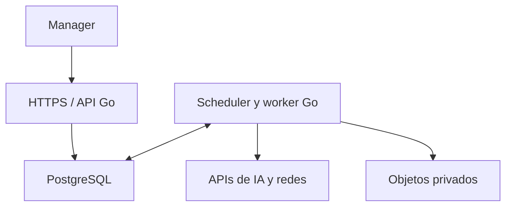

# BandIA — Operación autónoma desde el primer despliegue

Versión 1 · 9 de septiembre de 2026 · Análisis y diseño propuesto, sin infraestructura provisionada

Documento complementario del [spec](spec.md) y del [plan de API](api-implementation-plan.md). La dirección acordada es operar en un entorno desplegado que no dependa de mantener abierto ChatGPT o la computadora del manager. Esta revisión completa el diseño; no inicia despliegues, contratación, generación ni publicaciones.

## 1. Resultado esperado y límite de autonomía

El sistema conserva su estado, inicia reuniones en horario, ejecuta las tareas que surgen de ellas y aprende de resultados reales. Martín puede observar y cambiar dirección, pero no es una aprobación obligatoria de cada ciclo creativo. Nombre, integrantes, letras, arreglos y estética pueden evolucionar por decisiones registradas de la banda.

Esa autonomía artística no permite a los personajes modificar código del servidor, permisos, credenciales, presupuesto máximo o reglas operativas. Los agentes eligen entre herramientas y acciones de dominio implementadas. Una tarea novedosa sin herramienta disponible queda en el backlog con un bloqueo verificable; no se declara realizada.

La operación permanente requiere un runtime propio. La conexión de GitHub usada para desarrollar desde ChatGPT no ejecuta la banda, y la cuota de esa conexión no sustituye la facturación de los proveedores que use el runtime.

## 2. Opciones de infraestructura

| Alternativa | Qué administra el proyecto | Ventajas para la POC | Costos o límites operativos |
| --- | --- | --- | --- |
| **Aplicación en hosting administrado + PostgreSQL administrado + objetos** | Aplicación, esquema, credenciales, políticas y observabilidad | Menos tareas de sistema operativo; despliegue y servicios separados; recuperación independiente del contenedor | Cargos de cómputo/base/objetos; límites y suspensión dependen del plan elegido. |
| **VPS con Go y PostgreSQL + objetos externos** | Además, sistema operativo, actualizaciones, disco, TLS, backups y salud de la base | Control directo y despliegue compacto | Mayor mantenimiento; una falla del host afecta API, jobs y base; exige copias externas verificadas. |
| **Funciones o jobs efímeros con scheduler externo** | Coordinación entre ejecuciones, límites de duración y estado remoto | Útil si el flujo está dividido en pasos breves y retomables | Las llamadas largas, media processing y límites de ejecución complican el primer ciclo; requiere diseñar los cortes desde el inicio. |

**Propuesta inicial:** hosting administrado para una aplicación Go siempre activa, PostgreSQL administrado y objetos privados. Un único despliegue lógico puede albergar API, scheduler y worker. No hace falta Kubernetes, un broker independiente ni un servidor por personaje.

Los nombres de proveedores, planes, regiones y precios se decidirán después de revisar sus condiciones vigentes. Esta comparación es de arquitectura, no una cotización ni una afirmación de capacidades de un producto concreto.

### Requisitos para seleccionar el hosting

- Ejecutar un proceso persistente con tareas en segundo plano; no suspenderlo al dejar de recibir tráfico HTTP.
- Permitir salida HTTPS hacia los proveedores, manejo de señales y tiempo de apagado suficiente para guardar checkpoints.
- Exponer API por HTTPS con autenticación; base accesible sólo al servicio o a accesos administrativos controlados.
- Ofrecer secretos, logs, reinicio automático, versiones desplegadas identificables y capacidad de regresar a una imagen anterior.
- Dimensionar CPU/memoria y espacio temporal para el render, no sólo para servir endpoints. Procesar audio/video pesado fuera del proceso HTTP cuando la medición lo justifique.
- Verificar persistencia, exportación y recuperación de la base; ubicación, límites, costos de almacenamiento y transferencia de objetos.
- Evitar dependencias que sólo funcionen con una sesión interactiva de ChatGPT. Un dominio propio es opcional si el hosting ofrece HTTPS utilizable.

## 3. Topología inicial y separación futura

El dibujo separa responsabilidades; B y D pueden correr dentro del mismo proceso inicialmente. La base y el bucket tienen vida independiente del contenedor. Un monitor externo consulta salud y progreso del worker y entrega avisos al manager; debe detectar también la ausencia de señales, no sólo errores emitidos por el servicio.

Propuesta de capacidad inicial: una réplica de aplicación y un worker con concurrencia paga conservadora, configurable por proveedor. Primero permitir una llamada paga concurrente; abrir paralelismo tras medir latencia, memoria, cuotas y gasto. Los agentes siguen siendo ejecuciones independientes aunque sus aperturas se procesen secuencialmente.

Separar el worker de medios cuando sus picos afecten la API; agregar réplicas de workers sólo cuando la cola lo justifique y estén probados leases y control de concurrencia. El scheduler debe ser seguro aun si un despliegue solapa dos procesos. Una réplica inicial simplifica operación, pero no constituye alta disponibilidad.

## 4. Dónde vive cada dato

| Información | Ubicación y tratamiento |
| --- | --- |
| Código, contratos, migraciones, prompts base y fichas iniciales | Repositorio público; los commits identifican versiones de software. |
| Estado y memoria vigentes | PostgreSQL: identidades, instrucciones, conversaciones, decisiones, tareas, versiones musicales, feedback, trabajos y gastos. |
| Audio, imágenes, videos y exportaciones grandes | Bucket privado; la base contiene ubicación, tamaño, hash, tipo, estado, propietario y origen. |
| Archivos intermedios de render | Disco temporal con límites y limpieza; nunca la única copia de un resultado aceptado. |
| Claves y tokens | Secretos del entorno; los tokens renovables pueden requerir almacenamiento cifrado con clave externa a la base. Sin exposición al prompt ni al repositorio. |
| Logs técnicos | Servicio de logs con retención; IDs de correlación y errores saneados. Las conversaciones originales viven en su registro de dominio. |
| Backups | Copias privadas con acceso independiente, retención y restauración probada; no dentro del mismo disco temporal de la app. |

Las fichas iniciales se importan una vez con versión de semilla; reiniciar o desplegar no sobreescribe la evolución de los personajes. No se sube automáticamente cada conversación o canción a GitHub.

Guardar un mensaje o aceptar una decisión significa que su transacción se confirmó. Para objetos, primero cargar y verificar integridad, luego marcarlos disponibles en la base. Si uno de los pasos falla, queda un registro pendiente conciliable; un objeto huérfano se limpia tras un período de gracia y sólo si no tiene referencias.

## 5. Memoria de agentes y continuidad

Cada reunión fija un snapshot con identidad, participantes/fichas, instrucciones, decisiones, tareas, feedback y versión de política. Cada turno guarda el prompt de tarea y los mensajes realmente recibidos, la respuesta pública original y el uso informado por el proveedor.

Los resúmenes son vistas derivadas con referencias a fuentes. Una síntesis incorrecta puede regenerarse sin alterar la historia. El contexto se limita por presupuesto de tokens y relevancia: no volver a enviar todo el archivo histórico en cada turno. Registrar qué se seleccionó y qué antigüedad tiene el feedback.

Cambiar el modelo o el prompt no reescribe turnos ya completados. Una reanudación usa las versiones fijadas cuando siguen disponibles; si hay que migrarlas, registra la sustitución y su motivo. Si no puede reconstruir el contexto necesario, bloquea la reunión en lugar de inventar continuidad.

## 6. Una jornada de funcionamiento

1. El scheduler identifica el disparo de la fecha local y lo registra con clave única. Si ya existe, consulta su estado; no abre otro ciclo equivalente.
2. El worker comprueba pausa, dependencias, cuota, presupuesto y versión de estado. La captura de feedback tiene un plazo acotado; una falla no paraliza indefinidamente trabajo creativo independiente.
3. Ejecuta aperturas, réplicas y cierre de reunión mediante llamadas separadas. Confirma cada respuesta antes de avanzar a pasos que dependen de ella.
4. Valida las decisiones, conserva disensos y transforma hasta tres prioridades en tareas. Los handlers ejecutan escritura, música, contenido o experimentos según su disponibilidad.
5. Las generaciones pagan contra una reserva y dejan archivos verificables. Evaluaciones seleccionan o piden una revisión limitada; una demo fallida no se convierte en lanzamiento para cumplir una fecha.
6. Alex prepara y programa contenido. El worker vuelve a comprobar controles antes de enviar; confirma procesamiento e ID remoto antes de marcar publicado.
7. Se programan captura de resultados y evaluación de experimentos. La siguiente reunión recibe esas observaciones y aprendizajes.
8. El manager dispone de estado e informe. Recibe resumen semanal y avisos de bloqueos importantes por un canal todavía por elegir.

Algunos pasos cruzan días: una reunión puede completarse dejando una canción en producción. La reunión diaria revisa los trabajos existentes antes de iniciar otra canción; el calendario no duplica material en curso ni obliga a terminar todos los dominios en una única ejecución.

## 7. Tiempo, disponibilidad y objetivos propuestos

| Parámetro | Valor inicial para evaluar | Qué significa |
| --- | --- | --- |
| Reunión diaria | 08:00, `America/Argentina/Buenos_Aires` | Hora objetivo exacta; no una ventana flexible implícita. |
| Aviso de inicio demorado | A las 08:15 si no comenzó | Alerta por occurrence pendiente; detecta el problema que motivó esta revisión. |
| Recuperación tras caída | Retomar incompleto primero; crear como máximo el ciclo vigente omitido | No generar una ráfaga de reuniones por todos los días perdidos. Registrar los disparos omitidos. |
| Producción | Objetivo de una canción semanal | Una meta de planificación, sujeta a calidad y presupuesto. |
| Concurrencia paga | 1 inicialmente | Valor conservador de arranque; ajustar con datos. |
| Reintentos transitorios | Hasta 2 adicionales por paso, con espera creciente y jitter | Sólo cuando repetir sea seguro, con deadline total y reserva suficiente. |
| Evidencia de rutina | 7 días observados antes de llamarla confiable | Cada disparo debe tener ejecución o explicación; medir además cuántos completaron sin intervención. |

Son valores propuestos para configuración inicial; no son garantías ni parámetros ya activados. Los timeouts de texto, música y render se fijan por proveedor/tipo de trabajo al validar sus capacidades; no usar un único timeout HTTP corto para todos.

`/healthz` verifica el proceso. `/readyz` verifica que la API puede aceptar trabajo durable. `GET /v1/system` y los jobs informan qué capacidades de la banda están listas o bloqueadas. Un 200 de salud no demuestra que la reunión se celebró ni que X o el proveedor musical funcionen.

## 8. Fallos, reintentos y cancelación

| Situación | Respuesta del sistema | Intervención humana |
| --- | --- | --- |
| Reinicio durante una ronda | Expirar lease, reconstruir contexto y retomar el siguiente paso seguro | Normalmente ninguna. |
| Respuesta recibida pero perdida antes de persistir | Marcar intento incierto, conciliar si es posible y aplicar política de reintento/gasto | Sólo si no hay forma segura o presupuesto. |
| Base no disponible | No aceptar trabajo nuevo como guardado; readiness 503 y alerta externa | Si excede la recuperación del servicio. |
| Proveedor lento/caído o rate limit | Espera acotada, respeto del límite informado y reintentos seguros; luego bloqueo visible | Si persiste o requiere cambio de proveedor. |
| Credencial revocada o cuota agotada | Bloquear esa capacidad y las tareas dependientes | Renovar acceso o saldo cuando corresponda. |
| Audio/medio inválido | Registrar rechazo; revisión acotada o bloqueo | No se pide aprobar cada rechazo creativo. |
| Envío a X de resultado desconocido | Conciliar; si no puede confirmarse, detener reenvío y avisar | Puede necesitar verificación externa. |
| Presupuesto agotado | Detener nuevas operaciones pagas; continuar consultas y trabajo local posible | Aumentarlo es opcional, no automático. |
| Feedback no disponible | Informar cobertura/antigüedad, continuar tareas independientes | Sólo ante bloqueo persistente de acceso. |
| Manager pausa el sistema | Impedir nuevos pasos y efectos; conservar resultados de llamadas ya enviadas | Manager decide reanudar. |

La cancelación no deshace cargos o posts ya realizados. Cambiar una política se aplica antes del próximo efecto; la respuesta del control indica cuándo entró en vigor y qué ya estaba en vuelo. El objetivo es ejecución recuperable con deduplicación, sin prometer exactly-once sobre servicios externos.

## 9. Presupuesto y dimensionamiento

Separar gasto fijo de infraestructura y gasto variable de generación/lecturas/publicaciones/transferencia. Las cuotas de suscripciones interactivas no se consideran crédito de API sin validarlo. Los montos discutidos anteriormente eran orientativos; falta aprobar límites numéricos y revisar tarifas vigentes al elegir proveedores.

Modelo de costo mensual:

`infraestructura + texto + música + imágenes/video + APIs sociales + almacenamiento/transferencia + backups/monitoreo`

Para texto: sumar tokens de entrada y salida de todas las llamadas, multiplicados por tarifas correspondientes. Incluir historial enviado, cierres, resúmenes, tareas, evaluaciones y reintentos. No estimar únicamente por número de personajes.

Ejemplo de volumen, no de precio: con cinco participantes y el protocolo de dos rondas más cierre hay 11 llamadas por reunión. Treinta reuniones implican 330 llamadas base; no incluyen producción, feedback, informes ni reintentos. Si cada llamada tuviera en promedio 4.000 tokens de entrada y 700 de salida, serían 1.320.000 tokens de entrada y 231.000 de salida. Es un escenario aritmético para dimensionar, no consumo medido ni contexto garantizado.

Para música: `minutos por demo × demos por canción × canciones`, contando descartes. Para video: segundos renderizados/generados e intentos; para objetos: bytes retenidos, versiones, lecturas y transferencia. Medir costo por canción seleccionada, no sólo por generación exitosa.

Controles necesarios: límite mensual, por operación y por recurso/ciclo; máximo de intentos, duración y concurrencia; reservas atómicas; clasificación confirmado/estimado/pendiente; advertencias antes del límite. Al reducir un límite por debajo del uso comprometido, mostrar el exceso existente y detener nuevos compromisos, sin afirmar que lo deshizo.

Hasta medir carga, seleccionar capacidad con margen para el pico del render y registrar CPU, memoria, duración de cola y uso de disco temporal. No fijar una máquina específica por intuición ni contratar capacidad para GPU local: esta propuesta usa proveedores externos para generación.

## 10. Identidades, secretos y permisos

| Acceso | Quién lo usa | Alcance esperado |
| --- | --- | --- |
| GitHub de desarrollo | Manager y asistente autorizado | Código/documentación y flujo de cambios del proyecto. |
| Identidad de despliegue | CI/CD | Publicar la imagen y actualizar el servicio; acceso mínimo al destino. |
| Usuario de aplicación en base | Servicio Go | Operaciones de datos necesarias; separar permisos de migración cuando sea posible. |
| Bucket | Servicio y renderer | Objetos del proyecto; acceso temporal de lectura para el manager. |
| APIs de IA | Worker | Perfiles/capacidades y presupuestos configurados. |
| Autorización de X | Adaptador social | Una cuenta por conexión; distinguir lectura, publicación y futuras respuestas. |
| Acceso administrativo | Manager | Panel/API, políticas, pausas e integraciones. |

Los agentes no reciben tokens ni capacidad de ejecutar SQL/shell libremente. Los comentarios de redes se incorporan como datos externos, no como instrucciones que cambian permisos. Los logs de CI de un repositorio público no deben revelar secretos, prompts con datos privados ni volcados de producción. Los pipelines de contribuciones no confiables no reciben credenciales productivas.

Rotación: identificar secreto por nombre/versión sin exponerlo; validar el nuevo acceso, actualizar el runtime y revocar el anterior cuando proceda. Renovaciones OAuth concurrentes se serializan por cuenta. Antes de cada publicación se valida conexión vigente y política; desconectar una cuenta bloquea sus trabajos pendientes.

## 11. Despliegue reproducible y cambios de esquema

Propuesta de flujo: cambio versionado → pruebas y chequeos → imagen inmutable etiquetada por commit/digest → migración compatible → despliegue → smoke checks → observación de worker y jobs. La automatización de este flujo se implementará después; no se modifican permisos ni configuración de GitHub en este análisis.

Las pruebas normales usan proveedores fake y datos sintéticos; las pruebas reales pagas se ejecutan de forma controlada y con presupuesto, no en cada push. Se permite trabajar directamente con un entorno remoto de piloto, manteniendo un entorno reproducible de pruebas: desarrollar en la nube no elimina la necesidad de testear cambios aislados.

Un proceso único puede reiniciarse durante despliegues. Primero deja de tomar jobs, guarda checkpoints y libera/vence leases. Si se solapan versiones, locks y fencing evitan confirmaciones de workers antiguos. Cambios de esquema siguen expansión/migración/contracción; no eliminar columnas que todavía use la versión anterior.

Rollback de software: volver a una imagen compatible, no deshacer automáticamente datos, cargos o publicaciones. Una migración destructiva exige un plan de recuperación específico. Fijar cada job a las versiones necesarias; no cambiar su semántica al reiniciar en mitad de una reunión.

El piloto puede usar un solo entorno operativo y bases efímeras para tests para acotar costo. Antes de cambios con efectos externos, disponer de un modo donde publicar esté deshabilitado. Las fixtures y cuentas de prueba nunca se mezclan con métricas del experimento público.

## 12. Copias y restauración

Propuesta mínima para la POC: backup diario de PostgreSQL con retención de 14 días y protección/versionado de objetos cuando el proveedor lo permita. Evaluar recuperación a un instante si se requiere perder menos historial. Especificar cifrado, ubicación y costos al elegir servicios.

Objetivos provisionales de desastre: **RPO de hasta 24 horas** —cantidad de datos recientes que podría perderse— y **RTO de hasta 4 horas** —tiempo objetivo de restauración—. Son objetivos a comprobar, no garantías. La persistencia transaccional protege frente al reinicio normal del proceso; un backup diario no garantiza recuperar cada mensaje tras perder la base entera.

Procedimiento de restauración:

1. Pausar scheduler, operaciones pagas y publicaciones; conservar evidencia del incidente.
2. Restaurar base y objetos en un entorno aislado, sin ejecución automática de jobs.
3. Validar versiones, integridad, referencias y archivos; recuperar también el acceso seguro a secretos.
4. Conciliar operaciones externas ocurridas después del punto restaurado. Un post ya publicado puede faltar en la copia de la base; nunca relanzar todos los jobs recuperados a ciegas.
5. Marcar ambiguos los efectos sin conciliación posible; comprobar presupuesto y políticas vigentes.
6. Reanudar primero consultas y después tareas seguras; habilitar publicación al cerrar incertidumbres.
7. Registrar tiempo y pérdida real de datos y corregir el procedimiento.

Hacer una restauración de prueba antes del piloto autónomo y repetirla después de cambios materiales al modelo de datos/almacenamiento. Comprobar una copia no equivale a restaurarla.

## 13. Observabilidad e intervención del manager

Panel mínimo: última y próxima reunión, disparos omitidos, jobs por estado, antigüedad de cola/feedback, heartbeat del worker, producción disponible, publicaciones con enlace, consumo/reservas y bloqueos accionables. Vista de conversación original separada de resumen y razonamiento público de decisiones.

Métricas: tiempo desde agenda hasta inicio y cierre; duración/fallos por paso/proveedor; intentos por resultado; tiempo bloqueado; errores de integración; reservas pendientes; porcentaje de ciclos sin intervención y minutos humanos por semana. Una reunión que falla con buen diagnóstico es observable, pero no cuenta como un ciclo autónomo completado.

Alertas propuestas: inicio omitido, worker sin heartbeat, base inaccesible, credencial revocada, presupuesto cercano/al máximo, publicación incierta y backup fallido. Agrupar repeticiones, registrar recuperación y evitar un aviso por cada reintento. Definir canal y destinatario antes de habilitar envíos; este análisis no envía mensajes.

La pantalla de control debe distinguir: requiere acceso del manager, requiere decisión opcional, espera automática y trabajo fallido. No pedir aprobaciones creativas para resolver cada desacuerdo del elenco. El mantenimiento humano inevitable —credenciales, cuentas, pago, incidentes no recuperables— se mide como parte del experimento.

## 14. Incorporación de datos existentes y transición

La reunión manual 001 y sus fichas pueden importarse con sus IDs, mensajes originales y origen explícito `manual_agent_session`. Primero validar el paquete, versiones y hashes. El ejemplo fijo «Dejá una luz» pertenece a la simulación anterior: si se conserva, debe quedar como fixture, nunca canción real generada.

No importar ciegamente documentos de estado con versiones obsoletas. Comparar registros y conservar procedencia; una discrepancia se resuelve con evidencia. La importación es idempotente y no vuelve a ejecutar la reunión ni sus efectos.

La tarea previa de ChatGPT permanece separada. Durante pruebas del nuevo scheduler, deshabilitar ejecución productiva duplicada o usar un modo de observación. En el corte explícito, registrar pendientes, pausar el scheduler antiguo, importar estado necesario y habilitar el nuevo. Este documento no realiza esa transición ni afirma que la tarea previa haya funcionado.

## 15. Preparación y validación por capacidades

| Capacidad que se habilita | Dependencias mínimas | Evidencia necesaria |
| --- | --- | --- |
| API persistente | Hosting, HTTPS, autenticación, base/migraciones | Reinicio y despliegue conservan datos; readiness y accesos correctos. |
| Reunión real | Proveedor de texto, fichas, jobs, política y presupuesto | Turnos cruzados originales, uso registrado y reanudación probada. |
| Reunión diaria autónoma | Scheduler, recuperación y alerta externa | Siete días observados y prueba de disparo omitido/caída. |
| Demo musical | Proveedor musical, objetos, evaluación y límites | Audio verificable vinculado a decisiones y costos reales. |
| Lanzamiento | Cuenta autorizada, render, permisos y conciliación | Post verificable y prueba de resultado incierto sin duplicación. |
| Aprendizaje | Lectura de feedback, cobertura y experimentos | Cambio motivado por fuentes reales y evaluación honesta. |
| Piloto de 30 días | Capacidades anteriores, backups y panel | Reporte de autonomía, gastos, calidad, audiencia y fallos; restauración validada. |

Hospedar la base HTTP no cumple las otras capacidades. Cada una se habilita por configuración después de verificar sus dependencias; una falta de acceso en X no impide seguir una reunión escrita dentro del presupuesto. El orden detallado se mantiene en el [roadmap](roadmap.md).

## 16. Qué queda por elegir, sin bloquear el análisis

| Decisión | Propuesta base | Falta confirmar antes de usarla |
| --- | --- | --- |
| Hosting | Servicio administrado sin suspensión | Proveedor, plan, región, costos y límites reales. |
| Estado y medios | PostgreSQL administrado + bucket privado | Proveedores, backup, exportación, retención y tarifas. |
| Identidad/seguridad administrativa | Un manager; API autenticada y secretos separados | Método definitivo del panel y accesos de despliegue. |
| Horarios y recuperación | 08:00 Buenos Aires, aviso 08:15, sin ráfaga de catch-up | Aceptación de valores y comportamiento ante cambios de horario. |
| Presupuesto | Límites mensuales, por operación y ciclo; reserva previa | Importes y precios/máximos de cada capacidad. |
| Generación/evaluación | Proveedores API intercambiables | Acceso, calidad, control musical/vocal, licencias y costos vigentes. |
| Calidad y reintentos | Rúbrica automática y revisiones acotadas | Umbrales, plazo total y máximo por tipo de trabajo. |
| Alertas | Resumen semanal + bloqueos importantes | Canal, destinatario y autorización de envío. |
| Recuperación de desastre | Backup diario/14 días; RPO 24 h y RTO 4 h | Servicio que lo soporte y ensayo de restauración. |

La siguiente conversación puede convertir estas decisiones en una secuencia de implementación. Lo autorizado en esta revisión es completar y versionar el análisis; no provisionar infraestructura ni comenzar la implementación.
